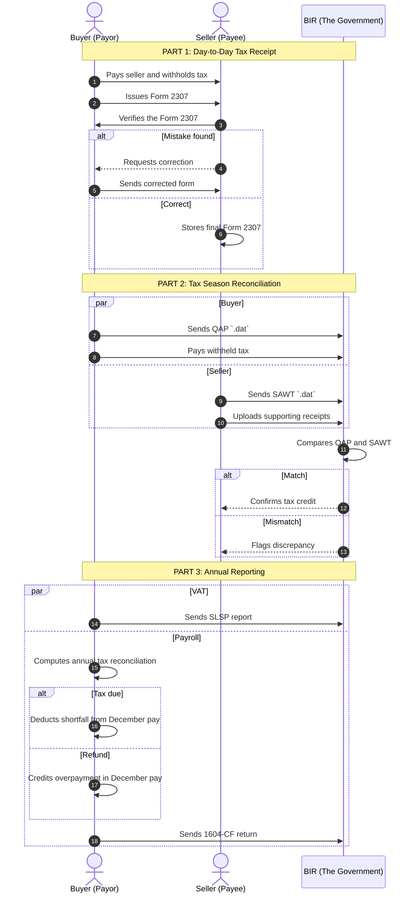

# BIR Compliance Domain Knowledge

**Project:** BIR Compliance Automation Module
**Product:** FullSuite
**Created:** June 12, 2026
**Version:** 1

**Authors:**
- Aldwin Bernard V. Loreto
- Lester Dann G. Lopez
- Mark John D. Barbieto
- Avril Viancene V. Caoile
- Dustin Lee A. Oliganga

## Summary

This document describes the business domain and system requirements for automating BIR filing in `app.getbira.com`.

The solution should:
- convert CSV source data into BIR-compliant `.dat` files,
- generate official BIR Form 2307 certificates,
- support QAP, Annual QAP, SLSP, SAWT, 1604-CF, and related filings,
- validate uploaded data and report row-level issues.

## 1. Problem Definition & Strategic Objective

### 1.1 Problem Statement

- Current tax preparation is manual, repetitive, and time-intensive.
- Staff spend significant effort formatting spreadsheets and preparing government files.
- Manual transcription increases the risk of human error, rejected filings, and compliance delays.

### 1.2 Objective

Automate tax compliance by transforming standard CSV inputs into government-ready output files and documents.

The system should:
- generate BIR Form 2307 certificates automatically,
- convert CSV data into `.dat` files for BIR e-submission,
- improve accuracy,
- reduce turnaround time,
- provide clear validation feedback.

## 2. Terms & Definitions

### 2.1 Key Terminology

| Term | Definition |
|---|---|
| BIR (Bureau of Internal Revenue) | The Philippines tax collection authority. |
| BIR Form 2307 | Certificate of Creditable Tax Withheld at Source issued by a buyer/payor to a seller/payee. |
| QAP (Quarterly Alphalist of Payees) | Quarterly report of sellers and taxes withheld by the withholding agent. |
| Annual QAP | Year-end consolidated QAP for final reconciliation. |
| SLSP (Summary List of Sales and Purchases) | Report of sales and purchases used for VAT compliance. |
| SAWT (Summary Alphalist of Withholding Taxes) | Seller report of withheld-income payments used to validate tax credits. |
| 1604-CF | Annual information return for income taxes withheld on compensation and final withholding taxes. |
| 1601-EQ | Quarterly Expanded Withholding Tax Return. |
| 1601-C | Monthly Remittance Return of Income Taxes Withheld on Compensation. |
| 1701 / 1702 / 1701Q / 1702Q | Annual or quarterly income tax returns for individuals and corporations. |
| 2550M / 2550Q | Monthly and quarterly VAT returns. |
| .dat file | Fixed-width or delimited text file format required by BIR for electronic submissions. |
| CSV file | Comma-separated values file used as system input. |
| eAFS System | Online portal for submitting Electronic Audited Financial Statements. |
| Buyer / Payor | Entity that pays for goods or services, withholds tax, and issues Form 2307. |
| Seller / Payee | Entity that receives payment and uses Form 2307 as proof of withheld tax. |

## 3. Target Outcome / Feature

### 3.1 Core System Processes

- **BIR Form 2307 Generation**: Automatically generate PDF certificates from transaction details.
- **File Conversion**: Convert validated CSV inputs into BIR-compliant `.dat` files for QAP, SLSP, SAWT, Annual QAP, and 1604-CF.
- **1604-CF Annualization Engine**: Calculate annual employee tax reconciliation and determine tax due or refund for December payroll.

### 3.2 System Data Requirements

- For Form 2307: Buyer and seller TIN, registered name, address, payment amount, tax withheld, and ATC.
- For QAP and SAWT: Validated Form 2307 transaction details.
- For CSV-to-`.dat` conversion: data sets for 1604-CF, SLSP, QAP, SAWT, and Annual QAP.
- Validation requirements: missing TINs, invalid numeric values, wrong file type, and malformed rows must block generation and surface precise error locations.

## 4. BIR Form Compliance & Process Workflow

### 4.1 The "Tax Receipt" Workflow

This workflow covers how a buyer withholds tax, issues Form 2307, and how QAP/SAWT reconciliation occurs.

1. Buyer pays Seller and withholds a portion of the payment.
2. Buyer creates BIR Form 2307 as proof of withheld tax.
3. Buyer provides Form 2307 to Seller.
4. Seller verifies names, TINs, and amounts.
5. If errors exist, Seller requests correction.
6. Buyer corrects and reissues the form.
7. Seller retains the final form for tax credit claims.
8. Buyer compiles a QAP of all withheld transactions.
9. Buyer submits QAP to BIR as a `.dat` file.
10. Buyer remits the total withheld tax to BIR.
11. Seller compiles a SAWT of all received Form 2307 certificates.
12. Seller submits SAWT to BIR as a `.dat` file.
13. Seller may upload scanned Form 2307s as proof.
14. BIR compares QAP and SAWT for matching amounts.
15. If they match, Seller receives the tax credit.
16. If they differ, BIR may investigate.
17. Buyer also prepares SLSP for VAT reporting.
18. Buyer submits SLSP to BIR for VAT reconciliation.
19. At year-end, employers reconcile employee tax in 1604-CF.
20. Employers compute final tax due or refund for the year.
21. Underpaid tax is collected from the December paycheck.
22. Overpaid tax is refunded in December payroll.
23. Employer submits Form 1604-CF to the BIR.

## 5. Success Matrix (KPIs)

| Success Metric | Target |
|---|---|
| Data Conversion Accuracy | 100% of generated `.dat` files pass BIR offline validation for a 500-record dataset. |
| Error Handling Reliability | 100% of invalid CSV uploads are blocked with row-level error feedback. |
| Form Generation Completion | 100% of test data produces a correctly formatted BIR Form 2307 PDF. |
| Processing Speed | Convert 500 transaction rows to `.dat` in under 10 seconds. |

## Appendix

> All visual examples, report layouts, and screenshots are illustrative mockups. They do not contain real client or sensitive data.

### A. BIR Form 2307

**Required data:**
- Buyer and seller TIN, registered name, and address.
- Alphanumeric Tax Code (ATC).
- Payment amount.
- Tax withheld amount.

**Purpose:** Proof of tax withheld, used by the seller to claim tax credits.

### B. QAP

**Required data:** Consolidated Form 2307 information for the quarter.

**Purpose:** Enables BIR to cross-check withholding tax remitted by the buyer against seller claims.

### C. SAWT

**Required data:** Incoming Form 2307 details from the seller's received receipts.

**Purpose:** Validates prepaid tax credits claimed by the seller.

### D. 1604-CF

**Required data:** Employee annual compensation schedule, taxable and non-taxable income, and monthly taxes withheld.

**Purpose:** Year-end reconciliation of employee withholding taxes.

### E. SLSP

**Required data:** Sales and purchase summaries, including VAT amounts and input VAT details.

**Purpose:** Supports quarterly VAT declarations and prevents under-reporting of sales or over-claiming of input VAT.
