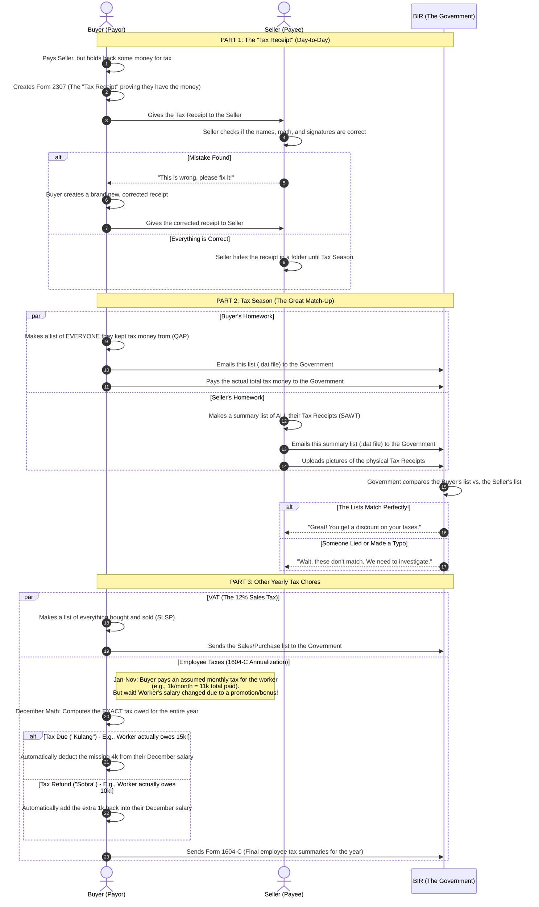

```mermaid
sequenceDiagram
    autonumber
    actor Buyer as Buyer (Payor)
    actor Seller as Seller (Payee)
    participant BIR as BIR (The Government)

    note over Buyer, BIR: PART 1: The "Tax Receipt" (Day-to-Day)
    
    Buyer->>Buyer: Pays Seller, but holds back some money for tax
    Buyer->>Buyer: Creates Form 2307 (The "Tax Receipt" proving they have the money)
    Buyer->>Seller: Gives the Tax Receipt to the Seller
    
    Seller->>Seller: Seller checks if the names, math, and signatures are correct
    alt Mistake Found
        Seller-->>Buyer: "This is wrong, please fix it!"
        Buyer->>Buyer: Buyer creates a brand new, corrected receipt
        Buyer->>Seller: Gives the corrected receipt to Seller
    else Everything is Correct
        Seller->>Seller: Seller hides the receipt in a folder until Tax Season
    end

    note over Buyer, BIR: PART 2: Tax Season (The Great Match-Up)
    
    par Buyer's Homework
        Buyer->>Buyer: Makes a list of EVERYONE they kept tax money from (QAP)
        Buyer->>BIR: Emails this list (.dat file) to the Government
        Buyer->>BIR: Pays the actual total tax money to the Government
    and Seller's Homework
        Seller->>Seller: Makes a summary list of ALL their Tax Receipts (SAWT)
        Seller->>BIR: Emails this summary list (.dat file) to the Government
        Seller->>BIR: Uploads pictures of the physical Tax Receipts
    end
    
    BIR->>BIR: Government compares the Buyer's list vs. the Seller's list
    
    alt The Lists Match Perfectly!
        BIR-->>Seller: "Great! You get a discount on your taxes."
    else Someone Lied or Made a Typo
        BIR-->>Seller: "Wait, these don't match. We need to investigate."
    end

    note over Buyer, BIR: PART 3: Other Yearly Tax Chores
    
    par VAT (The 12% Sales Tax)
        Buyer->>Buyer: Makes a list of everything bought and sold (SLSP)
        Buyer->>BIR: Sends the Sales/Purchase list to the Government
    and Employee Taxes (1604-C Annualization)
        note right of Buyer: Jan-Nov: Buyer pays an assumed monthly tax for the worker<br>(e.g., 1k/month = 11k total paid).<br>But wait! Worker's salary changed due to a promotion/bonus!
        Buyer->>Buyer: December Math: Computes the EXACT tax owed for the entire year
        alt Tax Due ("Kulang") - E.g., Worker actually owes 15k!
            Buyer->>Buyer: Automatically deduct the missing 4k from their December salary
        else Tax Refund ("Sobra") - E.g., Worker actually owes 10k!
            Buyer->>Buyer: Automatically add the extra 1k back into their December salary
        end
        Buyer->>BIR: Sends Form 1604-C (Final employee tax summaries for the year)
    end
```