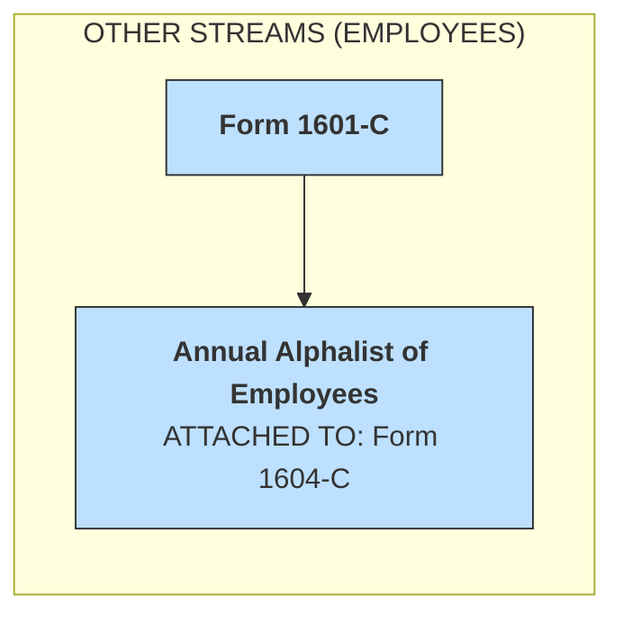

```mermaid
---
config:
  layout: fixed
---
flowchart LR
 subgraph subGraph0["OTHER STREAMS (EMPLOYEES)"]
        B["<b>Form 1601-C</b>"]
        C["<b>Annual Alphalist of Employees</b><br>ATTACHED TO: Form 1604-C"]
  end
    B --> C

    style B fill:#bde0fe,stroke:#333,stroke-width:1px
    style C fill:#bde0fe,stroke:#333,stroke-width:1px
```