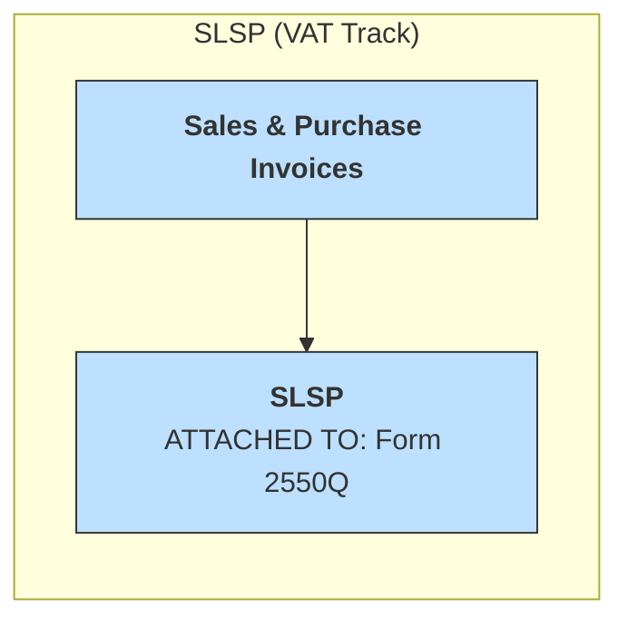

```mermaid
---
config:
  layout: fixed
---
flowchart LR
 subgraph subGraph0["SLSP (VAT Track)"]
        A["<b>Sales &amp; Purchase Invoices</b>"]
        B["<b>SLSP</b><br>ATTACHED TO: Form 2550Q"]
  end
    A --> B

    style A fill:#bde0fe,stroke:#333,stroke-width:1px
    style B fill:#bde0fe,stroke:#333,stroke-width:1px
```