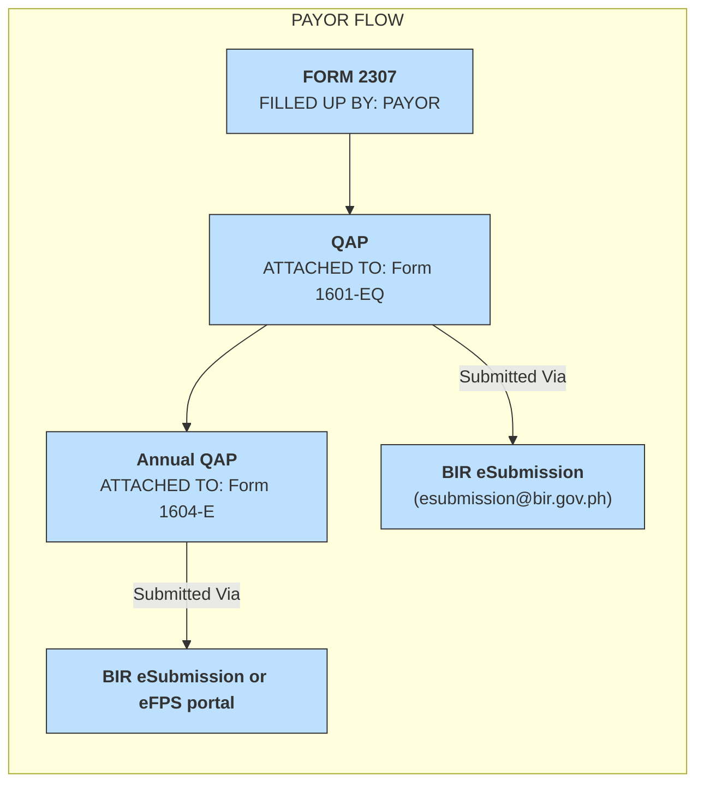

```mermaid
---
config:
  layout: fixed
---
flowchart LR
 subgraph subGraph0["PAYOR FLOW"]
        B["<b>QAP</b><br>ATTACHED TO: Form 1601-EQ"]
        A["<b>FORM 2307</b><br>FILLED UP BY: PAYOR"]
        C["<b>Annual QAP</b><br>ATTACHED TO: Form 1604-E"]
        D["<b>BIR eSubmission</b><br>(esubmission@bir.gov.ph)"]
        E["<b>BIR eSubmission or eFPS portal</b>"]
  end
    A --> B
    B --> C
    B -- Submitted Via --> D
    C -- Submitted Via --> E

    style B fill:#bde0fe,stroke:#333,stroke-width:1px
    style A fill:#bde0fe,stroke:#333,stroke-width:1px
    style C fill:#bde0fe,stroke:#333,stroke-width:1px
    style D fill:#bde0fe,stroke:#333,stroke-width:1px
    style E fill:#bde0fe,stroke:#333,stroke-width:1px

```
